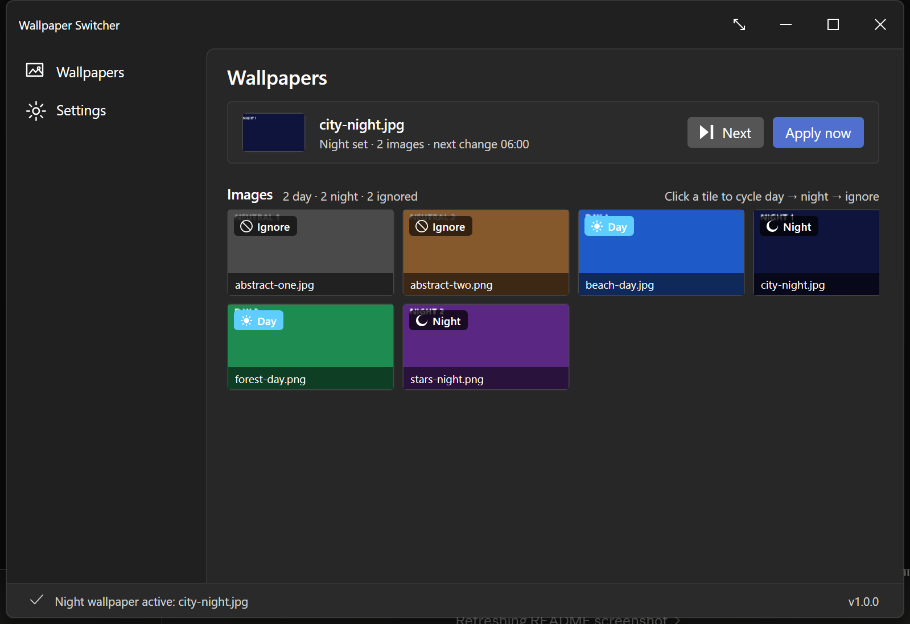

# Wallpaper Switcher

Switches your desktop wallpaper between **Day** and **Night** image sets based on
your local time, from a folder you choose. Open source, no account, no server, no
telemetry — it only ever reads the folder you point it at.

Runs on Windows, macOS, and Linux. Built with .NET 9 and Avalonia.



## What it does

- Pick one folder. Subfolders are scanned too.
- Tag each image **Day**, **Night**, or **Ignore**. Files with `day` or `night` in
  the name are tagged for you.
- Shuffle within the current set **every hour**, **every 6 hours**, **each day**,
  or **each week**.
- Set when day and night begin. A night window that crosses midnight works.
- Lives in the tray. Closing the window keeps it running; quit from the tray menu.
- Optionally starts when you sign in, and can start straight into the tray.

The image chosen for a given period is deterministic, so restarting the app does
not reshuffle your wallpaper.

## Install

Download from the [latest release](https://github.com/msk-one/WallpaperSwitcher/releases/latest).

### Windows

| | |
|---|---|
| **Installer** (recommended) | `WallpaperSwitcher-<version>-win-x64-Setup.exe` |
| **Portable** | `WallpaperSwitcher-<version>-win-x64.zip` |

The installer is per-user: it installs to `%LOCALAPPDATA%\Programs\WallpaperSwitcher`,
never prompts for administrator rights, and adds Start menu and Add/Remove
Programs entries. The portable zip is a single executable you can run from
anywhere, including a USB stick.

Windows 10 or 11, 64-bit. Nothing else to install — .NET is bundled.

### macOS

Download `WallpaperSwitcher-<version>-osx-arm64.dmg` (Apple silicon) or
`-osx-x64.dmg` (Intel), and drag the app to Applications. macOS 11 or later.

Because the app is not notarised, macOS will refuse to open it the first time.
Clear the quarantine flag once:

```bash
xattr -dr com.apple.quarantine /Applications/WallpaperSwitcher.app
```

### Linux

```bash
tar -xzf WallpaperSwitcher-<version>-linux-x64.tar.gz
chmod +x WallpaperSwitcher
./WallpaperSwitcher
```

Works with GNOME, KDE Plasma, XFCE, and any compositor with `swww` or `feh`
available. The app tries each in turn.

## About the security warnings

**Wallpaper Switcher is not code-signed**, so both Windows and macOS will warn you
before running it the first time.

- **Windows** shows "Windows protected your PC". Click **More info** →
  **Run anyway**.
- **macOS** shows "cannot be opened because the developer cannot be verified". Use
  the `xattr` command above.

This is not a judgement about the app — it is what every unsigned application
gets. Code-signing certificates cost several hundred dollars a year, which is
hard to justify for a free tool. Every release is built by
[GitHub Actions](.github/workflows/release.yml) from a public tag, and SHA-256
checksums are attached to each release so you can verify what you downloaded.

If you would rather not trust the binaries, [build from source](#build-from-source).
It takes one command.

## Using it

1. **Browse** to your wallpaper folder.
2. Tag images as **Day** or **Night**. Anything left as **Ignore** is never used.
3. Set **Day starts** and **Night starts** (24-hour like `06:00`, or `6:00 AM`).
4. Choose a **Shuffle** cadence, and on Windows a **Fit** mode.
5. **Save**.

The tray menu has the things you want without opening the window: cycle to the
next wallpaper now, swap the day and night hours, change cadence, toggle start at
login, and open the log folder.

### File formats

| Format | Preview | Applies as wallpaper |
|---|---|---|
| `.jpg` `.jpeg` `.png` `.bmp` `.gif` | Yes | Yes |
| `.tif` `.tiff` | No | Yes |
| `.heic` `.heif` `.webp` | `.webp` only | Only with the matching Windows codec installed |

Verified on Windows 11. `.tif`/`.tiff` apply correctly but have no preview
thumbnail, because the renderer the app uses cannot decode them. Files that
cannot be used are skipped in favour of the next image and noted in the log,
rather than leaving you with a blank desktop.

### Where your data lives

| | |
|---|---|
| Settings | `%LOCALAPPDATA%\WallpaperSwitcher\settings.json` (Windows)<br>`~/.local/share/WallpaperSwitcher/settings.json` (macOS, Linux) |
| Logs | the `logs` folder beside it, 7 days retained |

Settings are plain JSON you can read and edit. Uninstalling leaves them in place
unless you ask for them to be removed.

## Build from source

Requires the [.NET 9 SDK](https://dotnet.microsoft.com/download/dotnet/9.0).

```bash
git clone https://github.com/msk-one/WallpaperSwitcher.git
cd WallpaperSwitcher
dotnet build WallpaperSwitcher.sln -c Release
dotnet test WallpaperSwitcher.Tests/WallpaperSwitcher.Tests.csproj -c Release
```

Run it with:

```bash
dotnet run --project WallpaperSwitcher.Desktop
```

### Packaging

```powershell
./scripts/publish-windows.ps1
```

```bash
./scripts/package-macos-dmg.sh osx-arm64
```

Releases are built by `.github/workflows/release.yml`, which runs each target on
its own operating system. `scripts/publish-all.sh` is a development convenience
only — macOS builds it produces on a non-macOS host will not run, because arm64
macOS binaries need a code signature that `dotnet publish` only applies on macOS.

## Project layout

| | |
|---|---|
| `WallpaperSwitcher.Core/` | Scheduling, settings, and image selection. No UI, no platform dependencies. |
| `WallpaperSwitcher.Desktop/` | The Avalonia app and the per-OS wallpaper adapters. |
| `WallpaperSwitcher.Tests/` | Unit tests for the core. |
| `docs/design-notes.md` | How scheduling works and why, plus known limitations. |

The UI is built in C# rather than XAML. See [CONTRIBUTING.md](CONTRIBUTING.md)
before sending a patch.

## License

[MIT](LICENSE).
