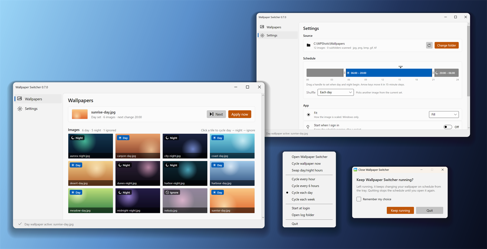
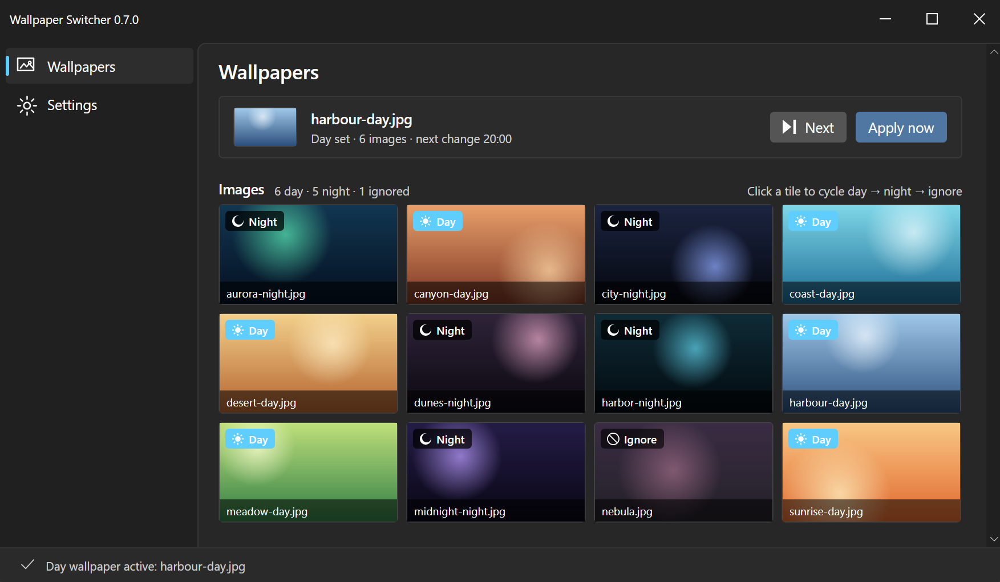
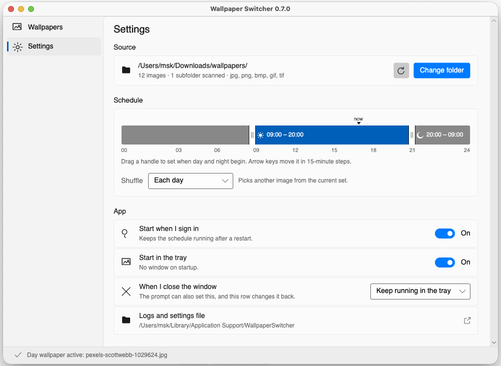

<div align="center">


<p>
  <a href="https://github.com/msk-one/WallpaperSwitcher/releases/latest"><b>Download</b></a>
  ·
  <a href="#what-it-does">Features</a>
  ·
  <a href="#install-it">Install</a>
  ·
  <a href="#how-it-works">How it works</a>
  ·
  <a href="#questions">FAQ</a>
  ·
  <a href="CHANGELOG.md">Changelog</a>
  ·
  <a href="CONTRIBUTING.md">Contribute</a>
  ·
  <a href="https://github.com/msk-one/WallpaperSwitcher/issues/new/choose">Report a bug</a>
</p>

<p>
  <a href="https://github.com/msk-one/WallpaperSwitcher/actions/workflows/ci.yml"></a>
  <a href="LICENSE"></a>
  
</p>

</div>

<br />

Wallpaper Switcher gives your desktop a **day set** and a **night set**, and swaps
between them on your computer's own clock. Point it at a folder you already have,
tag each picture as Day or Night, and forget about it: brighter photos while you
work, dark ones in the evening.

It is free and open source, under the MIT License. In this version, it's totally offline - no connections to the internet are being made. The only thing it ever touches is the folder you choose. I am thinking of additional plug-ins that will allow you to pair the app with online wallpaper hosting services. 



<br />

# Why WallpaperSwitcher?

**Most of operating systems can shuffle a folder of wallpapers. None of them know what
time it is. I just had this issue when working on my desktop PC, then on MacBook - and thought someone has to do it.**

The apps that do solve this usually come with strings attached: an account, a
subscription, a single photo service you have to take your pictures from, and a
background process quietly talking to somebody's server.

WallpaperSwitcher (okay, that placeholder name might change too) does the one job and stops there. Your pictures, your folder,
your machine's clock. Nothing is uploaded, nothing is downloaded, and if you
uninstall it, it's gone but wallpapers are not.

<br />

# What it does?

| Function | Description |
|---|---|
| **Day and night sets** | Tag each image Day, Night, or Ignore. Files with `day` or `night` in the name are tagged for you the moment you pick the folder. |
| **Your own folder** | One folder, subfolders included. Random photos, a pack you bought, a shared drive - it does not care where the pictures came from. |
| **Shuffle on your terms** | A different picture every hour, every 6 hours, each day, or each week. Or never: leave one image in a set and it stays put. |
| **You set the hours** | Drag a 24-hour bar to say when day and night begin. A night that runs from 21:00 to 07:00 works fine. |
| **Lives in the tray** | Change wallpaper, swap day and night, or switch cadence from the tray menu without opening the window. |
| **Starts with your computer** | Optional start-up scenario, and it can start straight into the tray with no window at all. |
| **Fits the screen properly** | On Windows, choose Fill, Fit, Stretch, Center, Tile, or Span across monitors. |
| **Looks like your desktop** | Follows your light or dark theme automatically, on all three operating systems. |

<br />

# Installation

**[⬇ Download the latest release](https://github.com/msk-one/WallpaperSwitcher/releases/latest)**

### Windows

| Method | File |
|---|---|
| **Installer** (easiest) | `WallpaperSwitcher-<version>-win-x64-Setup.exe` |
| **Portable** (no install) | `WallpaperSwitcher-<version>-win-x64.zip` |

Windows 10 or 11, 64-bit. Nothing else to install; everything it needs is inside.

The installer is per-user: it never asks for administrator rights, it adds the
usual Start menu and Add/Remove Programs entries, and uninstalling cleans up
after itself. The portable zip is a single file you can run from anywhere,
including a USB stick.

### macOS

macOS 11 or later. Download `WallpaperSwitcher-<version>-osx-arm64.dmg` for Apple
silicon or `-osx-x64.dmg` for Intel, and drag the app into Applications.

The first launch will be refused, because the app is not notarised by Apple. Run
this once in Terminal and it will open normally afterwards:

```bash
xattr -dr com.apple.quarantine /Applications/WallpaperSwitcher.app
```

### Linux

```bash
tar -xzf WallpaperSwitcher-<version>-linux-x64.tar.gz
chmod +x WallpaperSwitcher
./WallpaperSwitcher
```

`linux-arm64` is published too. Works on GNOME, KDE Plasma and XFCE, and on any
compositor with `swww` or `feh` available, it tries each in turn.

### Why does my computer warn me about it?

Because the app is **not code-signed**. Windows will say "Windows protected your
PC" (click **More info** → **Run anyway**) and macOS will say the developer
cannot be verified (use the `xattr` command above).

I'll probably make it easier by getting binary signing cert later on. Stay tuned.

What you get instead: every release is built in public by
[GitHub Actions](.github/workflows/release.yml) straight from a tagged commit, and
SHA-256 checksums are attached to each release so you can check that the file you
downloaded is the file that was built. And if you would rather trust nothing at
all, [build it yourself](#build-it-yourself) - it is one command.

<br />

# Usage

Pick your folder on **Settings**, then tag your pictures on **Wallpapers**.
Clicking a tile cycles it **Day → Night → Ignore**, and anything left on Ignore is
never used. There is no Save button - it's automatic.



Back on **Settings**, drag the bar to set when day and night begin, and choose how
often to shuffle. That window on macOS:



Closing the window asks whether to keep running in the tray or quit properly, and
can remember your answer: that row on Settings changes it back if you want to swap it.

<br />

# How it works?

A few decisions worth knowing about:
- **The picture for a given period is fixed, not random.** It is worked out from
  the date and the period, so restarting the app or rebooting gives you the same wallpaper back instead of a fresh shuffle.
- **A "day" ends when your night starts, not at midnight.** An evening that runs
  past midnight is still the same evening.
- **It wakes up when it should.** A timer fires on the next boundary, a
  once-a-minute check catches a machine that was asleep, and on Windows it also
  listens for the clock changing, the screen resolution changing, and other apps
  taking the wallpaper over.
- **A broken picture never ends with a blank desktop.** Images are checked
  before use, and an unusable one is skipped in favour of the next and noted in
  the log.
- **Your tags survive.** They are stored relative to the wallpaper folder,
  so renaming or moving it does not throw them away.

[`docs/design-notes.md`](docs/design-notes.md) goes into the details, including
daylight saving and the known limitations.

<br />

# FAQ

**Does it upload my photos anywhere?** No. The app makes no network connections
whatsoever so far. There is no account, no server and no telemetry.

**Does it need to be running?** Yes: it lives in the tray and changes the
wallpaper when the time comes. Turn on "Start when I sign in" and you can forget
it exists.

**What image formats work?**

| Format | Preview thumbnail | Works as wallpaper |
|---|---|---|
| `.jpg` `.jpeg` `.png` `.bmp` `.gif` | Yes | Yes |
| `.tif` `.tiff` | No | Yes |
| `.heic` `.heif` `.webp` | `.webp` only | Only with the matching Windows codec installed |

**Where does it keep my settings?** In plain, readable JSON:
`%LOCALAPPDATA%\WallpaperSwitcher\settings.json` on Windows, or
`~/.local/share/WallpaperSwitcher/settings.json` on macOS and Linux. Logs are
beside it and are kept for 7 days. Uninstalling leaves both alone unless you ask
for them to be removed.

**Can I have more than two sets?** Not in this version - may be a future feature or a contribution at some point.

**Something is wrong.** [Open an issue](https://github.com/msk-one/WallpaperSwitcher/issues/new/choose)
- the log folder is on the Settings page, and attaching it helps a lot.

<br />

# Build it yourself

You need the [.NET 9 SDK](https://dotnet.microsoft.com/download/dotnet/9.0).

```bash
git clone https://github.com/msk-one/WallpaperSwitcher.git
cd WallpaperSwitcher
dotnet build WallpaperSwitcher.sln -c Release
dotnet test WallpaperSwitcher.Tests/WallpaperSwitcher.Tests.csproj -c Release
dotnet run --project WallpaperSwitcher.Desktop
```

To produce the same artifacts a release does:

```powershell
./scripts/publish-windows.ps1                # portable zip + Inno Setup installer
```

```bash
./scripts/package-macos-dmg.sh osx-arm64     # .app bundle + DMG, macOS only
./scripts/publish-linux.sh linux-x64         # tarball
```

Each target is built on its own operating system, which is exactly what
[`.github/workflows/release.yml`](.github/workflows/release.yml) does. A macOS
build produced anywhere but macOS will not run: arm64 binaries need a signature that `dotnet publish` only applies on a Mac.

### Project layout

| Project/file | Description |
|---|---|
| `WallpaperSwitcher.Core/` | Scheduling, settings, and image selection. |
| `WallpaperSwitcher.Desktop/` | The Avalonia app and the per-OS wallpaper adapters. |
| `WallpaperSwitcher.Tests/` | Unit tests for the core. |
| `docs/design-notes.md` | How scheduling works and why, plus known limitations. |

Built with [.NET 9](https://dotnet.microsoft.com/) and
[Avalonia](https://avaloniaui.net/). The UI is written in C# not XAML:
[CONTRIBUTING.md](CONTRIBUTING.md) explains why, and covers the pull request process.

<br />

# License

[MIT](LICENSE). Do what you like with it!

<br />

# More

<div align="center">

**If this is useful to you, a star helps other people find it.** ⭐

</div>
